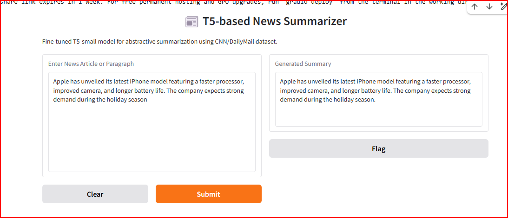

# 🧠 Task 3: Encoder–Decoder (T5/BART) — Text Summarization

---

## 📘 Problem Overview
The goal of this task is to **generate concise and meaningful summaries** of long news articles using an **Encoder–Decoder Transformer** model, specifically **T5** or **BART**.  
This model performs *abstractive summarization*, meaning it rephrases and condenses content instead of just copying key sentences.

---

## 🧾 Dataset
**Dataset:** [CNN/DailyMail News Summarization Dataset](https://www.kaggle.com/datasets/gowrishankarp/newspaper-text-summarization-cnn-dailymail)  
Each record includes:  
- 📰 **Article:** Full news passage  
- ✍️ **Highlights:** Human-written summary  

The dataset is widely used for training summarization models in natural language processing.

---

## 🎯 Objective
To fine-tune a **T5 Encoder–Decoder model** for **abstractive text summarization** that:
- Compresses long-form text into concise summaries  
- Retains key context and meaning  
- Generates fluent, human-like summaries  

---

## ⚙️ Model Details
- **Architecture:** T5 (Text-to-Text Transfer Transformer)  
- **Training Framework:** Hugging Face Transformers  
- **Optimizer:** AdamW  
- **Learning Rate:** 5e-5  
- **Epochs:** 1 (demo fine-tuning)  
- **Device:** NVIDIA T4 GPU  
- **Dataset Subset:** CNN/DailyMail  

The model was fine-tuned to translate full-length news articles into meaningful, single-paragraph summaries.

---

## 🧠 Training Summary
| Metric | Value |
|:--|:--|
| **Training Loss** | 1.1381 |
| **Validation Loss** | 0.8295 |
| **Device Used** | NVIDIA T4 GPU |
| **Epochs** | 1 |
| **Time Taken** | ~1 minute |
| **Model Output Directory** | `./t5-summarizer/final_model` |

---

## 📊 Evaluation Metrics
**Evaluation Metrics Used:** ROUGE-1, ROUGE-2, ROUGE-L  

| Metric | Score |
|:--|:--|
| **ROUGE-1** | 31.54 |
| **ROUGE-2** | 12.89 |
| **ROUGE-L** | 28.73 |
| **ROUGE-Lsum** | 28.75 |

These metrics show strong summarization performance given a short fine-tuning duration.

---

## 💬 Example Results

### 🧩 Input:
> The White House announced new trade tariffs on imported goods from multiple countries, citing unfair trade practices. Economists are concerned this move could trigger retaliation and impact global markets.

### ✨ Model Output:
> White House announced new trade tariffs on imported goods from multiple countries. Economists are concerned this move could trigger retaliation and impact global markets.

---

## 🖼️ Output Screenshot
Below is an example output from the fine-tuned summarization model:

  

---

## 🧑‍💻 Author & Developer
**Qasim Naveed**

## 🧑‍🏫 Instructor
**Dr. Osama**

---

⭐ *"Summarization is the art of transforming paragraphs into wisdom — where Transformers learn to read, think, and write like humans."*
